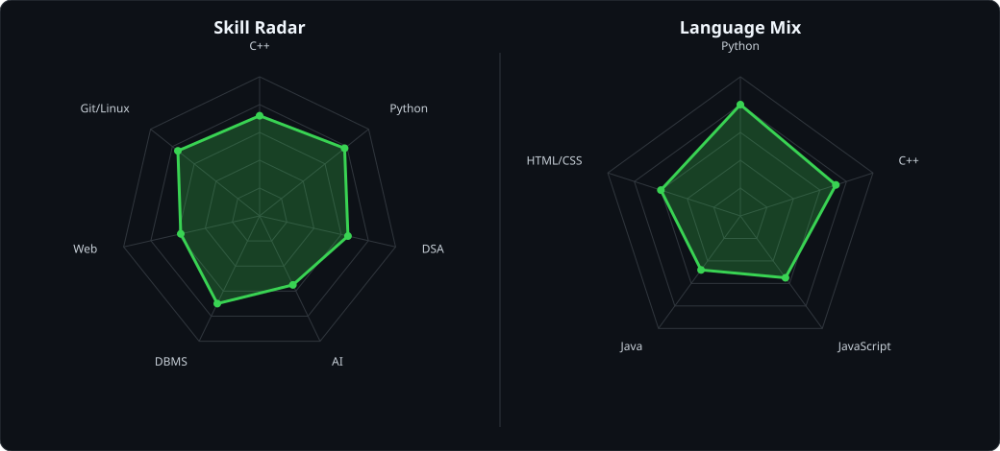
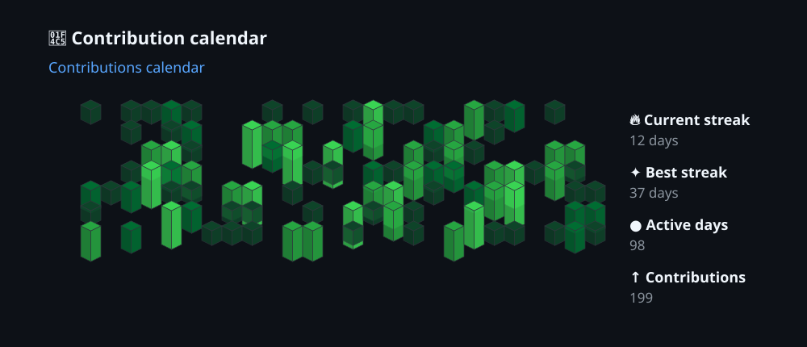
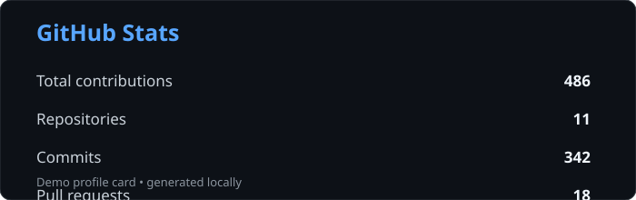
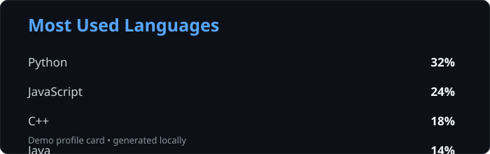
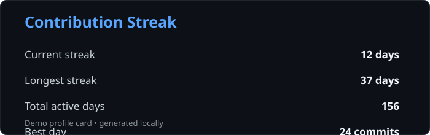
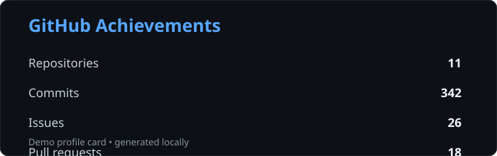

<p align="center">
  
</p>

---

# `~/` whoami

> **Shivam Kumar Singh** — CSE student at IIIT Manipur, exploring AI, software development, and problem solving.

### 🔭 Currently working on

Building strong CSE fundamentals at IIIT Manipur and exploring AI basics.

### 👯 Looking to collaborate on

Beginner-friendly AI projects, open-source work, and college tech projects.

### 🤝 Looking for help with

Deepening AI concepts and improving coding & problem-solving skills.

### 🌱 Currently learning

C++, Python, AI basics, DBMS, Git/GitHub, and Linux.

### 💬 Ask me about

IIIT Manipur life, CSE basics, AI learning path, and Linux setup.

---

## `~/` portfolio

> 🚧 **Coming soon.**

---

## `~/` connect

[](https://bsky.app/profile/s-hivam96.bsky.social)
[](https://instagram.com/something.shivam)
[](https://linkedin.com/in/og-shivam)
[](mailto:shivamkrsingh112@gmail.com)

---

## `~/` toolbox

<table>
<tr>

<td valign="top" width="33%">

### Languages


</td>

<td valign="top" width="33%">

### Web


</td>

<td valign="top" width="33%">

### Tools


</td>

</tr>
</table>

---

## `~/` skill radar

<p align="center">
  
</p>

> Personal skill overview — continuously improving.

---

## `~/` contribution calendar

<p align="center">
  
</p>

> Contribution activity visualization.

---

## `~/` github

### GitHub Stats

<p align="center">
  
</p>

### Most Used Languages

<p align="center">
  
</p>

### Contribution Streak

<p align="center">
  
</p>

---

## `~/` achievements

<p align="center">
  
</p>

---

## `~/` projects

<table>
<tr>

<td width="50%" valign="top">

### 🎬 Netflix Clone

A Netflix-inspired streaming platform built to practice frontend development, API integration, responsive UI, and component-based development.

**Tech:** HTML · CSS · JavaScript · API

</td>

<td width="50%" valign="top">

### 🛒 Amazon Clone

An Amazon-inspired e-commerce interface created to practice frontend development, layouts, product interfaces, and API-based data handling.

**Tech:** HTML · CSS · JavaScript · API

</td>

</tr>

<tr>

<td width="50%" valign="top">

### 📊 Data Science Projects

Data analysis and machine-learning experiments focused on Python, data processing, visualization, and exploring practical AI concepts.

**Tech:** Python · Pandas · NumPy · Matplotlib · Machine Learning

</td>

<td width="50%" valign="top">

### 🧠 DSA & LeetCode

My ongoing problem-solving journey covering algorithms, data structures, and competitive programming practice.

**Progress:** 100+ problems solved

**Focus:** C++ · DSA · Problem Solving

</td>

</tr>
</table>

---

## `~/` currently learning

```text
C++
 │
 ├── Data Structures & Algorithms
 │
 ├── Python
 │
 ├── DBMS
 │
 ├── Artificial Intelligence
 │
 └── Data Science
